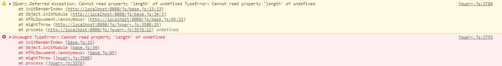

# 使用jQuery实现清单应用的过程

## 进行清单应用的整体布局
1. 准备好相关的文件夹和文件`css js index.html`等等
2. 引入需要使用到的css文件和js文件 
3. 使用html实现静态布局，并没有进行界面美化
```html
<!DOCTYPE html>
<html lang="en">
<head>
    <meta charset="UTF-8">
    <meta name="viewport" content="width=device-width, initial-scale=1.0">
    <meta http-equiv="X-UA-Compatible" content="ie=edge">
    <title>MyToDo</title>
    <link rel="stylesheet" href="./css/jquery.datetimepicker.min.css">
    <link rel="stylesheet" href="./css/normalize.css">
    <link rel="stylesheet" href="./css/base.css">
</head>
<body>
    <div class="container">
        <h1>MyToDo</h1>
        <form class="clearfix add-task">
            <input type="text" class="content">
            <button class="addTaskSubmit">submit</button>
        </form>
        <ul class="task-list">
            <li class="task-item">
                <span><input type="checkbox"></span>
                <span class="item-content">啦啦啦啦啦啦啦啦啦啦</span>
                <span class="fr">
                    <span class="action detail">详情</span>
                    <span class="action delete">删除</span>
                </span>
            </li>
            <li class="task-item">
                <span><input type="checkbox"></span>
                <span class="item-content">啦啦啦啦啦啦啦啦啦啦</span>
                <span class="fr">
                    <span class="action detail">详情</span>
                    <span class="action delete">删除</span>
                </span>
            </li>
        </ul>
    </div>
    <div class="task-detail">
        <p>任务描述</p>
        <input type="text" class="detail-content">
        <p>任务详情</p>
        <textarea class="desc"></textarea>
        <p>设置闹钟</p>
        <input type="date" class="datetime">
        <button class="detail-submit">提交</button>
    </div>

    <script src="./js/jquery.js"></script>
    <script src="./js/jquery.datetimepicker.full.js"></script>
    <script src="./js/store.js"></script>
    <script src="./js/base.js"></script>
</body>
</html>
```


## 清单布局的界面美化
1. 使用css美化界面，根据自己的喜好调整界面面的样式
2. 同时给标签添加class
```css
*{
	box-sizing: border-box;
	outline: 0;
	transition: 0.3s;
}
ul{
	padding: 0;
	list-style: none;
}
p{
	margin: 8px;
}
.fr{
	float: right;
}
.clearfix::after{
	content: '';
	display: block;
	clear: both;
}
body{
	background-color: #00334B;
}
.container{
	max-width: 700px;
	margin: 0 auto;
}
.container h1{
	text-align: center;
	color: #fff;
}
input,button{
	padding: 10px 0;
	border: none;
	border-radius: 3px;
}
.container form{
	margin-bottom: 10px;
}
.container form input{
	float: left;
	width: 84%;
	margin-right: 1%;
	text-indent: 1em;
}
.container form button{
	width: 15%;
	background-color: #0E98DA;
	cursor: pointer;
}

.container form button:hover{
	background-color: #01547B;
}
.container .task-list .task-item{
	padding: 10px;
	background-color: #fff;
	border-radius: 3px;
	margin-bottom: 4px;
	cursor: pointer;
}
.container .task-list .task-item:hover{
	background-color: #ddd;
}
.container .task-list .task-item .item-content{
	margin-left: 10px;
}
.container .task-list .task-item .action{
	color: #888;
	font-size: 14px;
	cursor: pointer;
}
.container .task-list .task-item .action:hover{
	color: #333;
}

.task-detail{
	display: none;
	position: absolute;
	left: 50%;
	top: 134px;
	margin-left: -150px;
	width: 300px;
	height: 360px;
	padding: 10px;
	background-color: #ccc;
	border-radius: 5px;
}
.task-detail input,
.task-detail textarea{
	width: 100%;
}
.task-detail textarea{
	resize: none;
	height: 100px;
}
.task-detail button{
	padding: 10px 8px;
	background-color: #0E98DA;
	margin-top: 6px;
}
```

## 模块化编程大致的思路
1. 首先定义一个模块`var myToDoModule = (function(){})();`
2. 初始化对象`initJqVar`
3. 写页面初始化就要执行的方法`initModule`，把`initJqVar()`放到`initModule`里面
4. 最后把对象`return`出去，`return { initModule : initModule }`
注：模块化编程的好处：提高安全性
```js
var myToDoModule = (function(){
    // 初始化jquery对象
    var initJqVar = function(){

    }

    //页面初始化就要执行的方法放在initModule里面
    var initModule = function(){
        initJqVar();
    }

	return {
		initModule : initModule
	}


})();

$(function(){
	myToDoModule.initModule();
})
```

## 实现清单应用的初始化显示

如何实现初始化渲染：

1. 定义`initRenderIndex`初始化渲染的方法，把`initRenderIndex()`放到`initModule`里面
2. 丰富`initRenderIndex`方法的内容
   1. 首先你需要一个**`task_list`数组**来存储需要遍历的对象，所以要提前声明并获取好`task_list`  数组
   2. 把容器里面的内容给清空
   3. 从`store.js`中取出已经存进去的任务列表
   4. 声明一个**空字符串`taskHtmlStr`**存储遍历的字符串
   5. 遍历数组并拼接字符串，然后渲染到页面上

```js
var myToDoModule = (function(){
	// 定义变量
	var task_list = [];
	var $task_list;

	// 初始化jquery对象
    var initJqVar = function(){
		$task_list = $('.task-list');
	}
	// 页面初始化的时候，从store中取出item，并渲染
	var initRenderIndex = function(){
		$task_list.html('');
		task_list = store.get('task_list');
		var taskHtmlStr = '';
		for (var i = 0; i < task_list.length; i++) {
			var oneItem = '<li class="task-item">'+
						'<span><input type="checkbox"></span>'+
						'<span class="item-content">'+ task_list[i].content +'</span>'+
						'<span class="fr">'+
						'	<span class="action detail">详情</span>'+
						'	<span class="action delete">删除</span>'+
						'</span>'+
					'</li>';
			taskHtmlStr += oneItem;
		}
		// 把最后的结果添加到$task_list节点的里面
		// 方法1.append 方法2.appendTo
		$(taskHtmlStr).appendTo($task_list)
	}

    //页面初始化就要执行的方法放在initModule里面
    var initModule = function(){
		initJqVar();
		initRenderIndex();
    }

	return {
		initModule : initModule
	}


})();

$(function(){
	myToDoModule.initModule();
})
```

## 实现清单应用的添加任务

如何实现添加任务操作：

1. 添加 `addTask` 的方法，把`addTask()`放到**提交按钮**触发的事件里面
2. 丰富`addTask`方法的内容
   1. 声明`new_task`对象
   2. 将`input`框的值赋值给`new_task`对象的`content`，注：要提前声明并获取好`$content`  对象
   3. 更新数组操作
   4. 保存数据到`store`里面
   5. 渲染新添加的数据，注：需要弄另外一个`renderOneItem`函数去实现这个效果
   6. 声明并获取好`$addTaskSubmit`  对象，并为其添加监听事件

```js
var myToDoModule = (function(){
	// 定义变量
	var task_list = [];
	var $task_list,$content,$addTaskSubmit;

	// 初始化jquery对象
    var initJqVar = function(){
		$task_list = $('.task-list');
		$content = $('.content');
		$addTaskSubmit = $('.addTaskSubmit');
	}
	// 页面初始化的时候，从store中取出item，并渲染
	var initRenderIndex = function(){
		$task_list.html('');
		task_list = store.get('task_list') || [];
		var taskHtmlStr = '';
		for (var i = task_list.length-1; i >= 0; i--) {
			var oneItem = '<li class="task-item">'+
						'<span><input type="checkbox"></span>'+
						'<span class="item-content">'+ task_list[i].content +'</span>'+
						'<span class="fr">'+
						'	<span class="action detail">详情</span>'+
						'	<span class="action delete">删除</span>'+
						'</span>'+
					'</li>';
			taskHtmlStr += oneItem;
		}
		// 把最后的结果添加到$task_list节点的里面
		// 方法1.append 方法2.appendTo
		$(taskHtmlStr).appendTo($task_list)
	}

	// 添加 task-item 的方法
	var addTask = function(){
		var new_task = {};
		// 获取输入框的内容
		new_task.content = $content.val();
		// 更新数组操作
		task_list.push(new_task);
		store.set('task_list',task_list);
		// 渲染新添加的数据
		renderOneItem(new_task);
	}

	// 向html列表中新添加一条记录
	var renderOneItem = function(new_task){
		var oneItem = '<li class="task-item">'+
				'<span><input type="checkbox"></span>'+
				'<span class="item-content">'+ new_task.content +'</span>'+
				'<span class="fr">'+
				'	<span class="action detail">详情</span>'+
				'	<span class="action delete">删除</span>'+
				'</span>'+
			'</li>';
			$(oneItem).prependTo($task_list);
			// 渲染完成之后，清空输入框的内容
			$content.val('');
	}

	// 添加任务按钮监听事件
	var listenAddTaskItem = function(){
		$addTaskSubmit.click(function(){
			addTask()
		});
	}

    //页面初始化就要执行的方法放在initModule里面
    var initModule = function(){
		// store.set('task_list',task_list)
		initJqVar();
		initRenderIndex();
		listenAddTaskItem();
    }

	return {
		initModule : initModule
	}


})();

$(function(){
	myToDoModule.initModule();
})
```

##  实现清单应用的更改任务详情

如何实现更改任务详情：

1. 定义`listenDetail`方法，把`listenDetail()`放到`initModule`里面
2. 定义点击详情和删除的时候记录的索引index`detailIndex、deleteIndex`
3. 丰富`listenDetail`方法的内容
   1. 要提前声明并获取好`$task_detail、$detail_content、$desc、$datetime`  对象
   2. 当鼠标点击详情的时候，找到详情的爸爸的爸爸的索引值`index`
   3. 使任务详情对象显示，并且显示任务里面对应的内容

```js
var myToDoModule = (function(){
	// 定义变量
	var task_list = [];
	var $task_list,$content,$addTaskSubmit,$task_detail,$detail_content,$desc,$datetime;
	var detailIndex,deleteIndex; // 定义点击详情和删除的时候记录的索引index

	// 初始化jquery对象
    var initJqVar = function(){
		$task_list = $('.task-list');
		$content = $('.content');
		$addTaskSubmit = $('.addTaskSubmit');
		$task_detail = $('.task-detail');
		$detail_content = $('.detail-content');
		$desc = $('.desc');
		$datetime = $('.datetime');
	}
	// 页面初始化的时候，从store中取出item，并渲染
	var initRenderIndex = function(){
		$task_list.html('');
		task_list = store.get('task_list') || [];
		var taskHtmlStr = '';
		for (var i = task_list.length-1; i >= 0; i--) {
			var oneItem = '<li class="task-item">'+
						'<span><input type="checkbox"></span>'+
						'<span class="item-content">'+ task_list[i].content +'</span>'+
						'<span class="fr">'+
						'	<span class="action detail">详情</span>'+
						'	<span class="action delete">删除</span>'+
						'</span>'+
					'</li>';
			taskHtmlStr += oneItem;
		}
		// 把最后的结果添加到$task_list节点的里面
		// 方法1.append 方法2.appendTo
		$(taskHtmlStr).appendTo($task_list)
	}

	// 添加 task-item 的方法
	var addTask = function(){
		var new_task = {};
		// 获取输入框的内容
		new_task.content = $content.val();
		// 更新数组操作
		task_list.push(new_task);
		store.set('task_list',task_list);
		// 渲染新添加的数据
		renderOneItem(new_task);
	}

	// 向html列表中新添加一条记录
	var renderOneItem = function(new_task){
		var oneItem = '<li class="task-item">'+
				'<span><input type="checkbox"></span>'+
				'<span class="item-content">'+ new_task.content +'</span>'+
				'<span class="fr">'+
				'	<span class="action detail">详情</span>'+
				'	<span class="action delete">删除</span>'+
				'</span>'+
			'</li>';
			$(oneItem).prependTo($task_list);
			// 渲染完成之后，清空输入框的内容
			$content.val('');
	}

	// 添加任务按钮监听事件
	var listenAddTaskItem = function(){
		$addTaskSubmit.click(function(){
			addTask()
		});
	}

	// 点击任务详情编辑任务明细
	var listenDetail = function(){
		$('.detail').click(function(){
			detailIndex = task_list.length - 1 - $(this).parent().parent().index();
			$task_detail.show();
			$detail_content.val(task_list[detailIndex].content);
			$desc.val(task_list[detailIndex].desc);
			$datetime.val(task_list[detailIndex].datetime);
		})
	}

    //页面初始化就要执行的方法放在initModule里面
    var initModule = function(){
		// store.set('task_list',task_list)
		initJqVar();
		initRenderIndex();
		listenAddTaskItem();
		listenDetail();
        // 应用日历插件
		$datetime.datetimepicker();
    }

	return {
		initModule : initModule
	}


})();

$(function(){
	myToDoModule.initModule();
})
```

##  实现清单应用的保存任务详情

如何实现保存任务详情操作：

1. 要提前声明并获取好`$detail_submit`  对象
2. 添加 `listenDetailSave` 的方法，把`listenDetailSave()`放到`initModule`里面
3. 丰富`listenDetailSave`方法的内容
   1. 新声明一个`dataTask`对象，给`dataTask`对象的属性赋值
   2. 更新`task_list`对象，注：修改后的对象和原来的对象合并 `$.extend(jsonObj1,jsonObj2)`
   3. 保存到`store`里面
   4. 清空任务详情对话框的内容，隐藏任务详情对话框
   5. 重现渲染页面，可能会遇到坑，请看**坑五**

```js
var myToDoModule = (function(){
	// 定义变量
	var task_list = [];
	var $task_list,$content,$addTaskSubmit,$task_detail,$detail_content,$desc,$datetime,$detail_submit;
	var detailIndex,deleteIndex; // 定义点击详情和删除的时候记录的索引index

	// 初始化jquery对象
    var initJqVar = function(){
		$task_list = $('.task-list');
		$content = $('.content');
		$addTaskSubmit = $('.addTaskSubmit');
		$task_detail = $('.task-detail');
		$detail_content = $('.detail-content');
		$desc = $('.desc');
		$datetime = $('.datetime');
		$detail_submit = $('.detail-submit');
	}
	// 页面初始化的时候，从store中取出item，并渲染
	var initRenderIndex = function(){
		$task_list.html('');
		task_list = store.get('task_list') || [];
		var taskHtmlStr = '';
		for (var i = task_list.length-1; i >= 0; i--) {
			var oneItem = '<li class="task-item">'+
						'<span><input type="checkbox"></span>'+
						'<span class="item-content">'+ task_list[i].content +'</span>'+
						'<span class="fr">'+
						'	<span class="action detail">详情</span>'+
						'	<span class="action delete">删除</span>'+
						'</span>'+
					'</li>';
			taskHtmlStr += oneItem;
		}
		// 把最后的结果添加到$task_list节点的里面
		// 方法1.append 方法2.appendTo
		$(taskHtmlStr).appendTo($task_list)
		listenDetail(); // 必须再次注册click事件
		listenDelete();
	}

	// 添加 task-item 的方法
	var addTask = function(){
		var new_task = {};
		// 获取输入框的内容
		new_task.content = $content.val();
		// 更新数组操作
		task_list.push(new_task);
		store.set('task_list',task_list);
		// 渲染新添加的数据
		renderOneItem(new_task);
	}

	// 向html列表中新添加一条记录
	var renderOneItem = function(new_task){
		var oneItem = '<li class="task-item">'+
				'<span><input type="checkbox"></span>'+
				'<span class="item-content">'+ new_task.content +'</span>'+
				'<span class="fr">'+
				'	<span class="action detail">详情</span>'+
				'	<span class="action delete">删除</span>'+
				'</span>'+
			'</li>';
			$(oneItem).prependTo($task_list);
			// 渲染完成之后，清空输入框的内容
			$content.val('');
			listenDetail(); // 必须再次注册click事件
			listenDelete();
	}

	// 添加任务按钮监听事件
	var listenAddTaskItem = function(){
		$addTaskSubmit.click(function(){
			addTask()
		});
	}

	// 点击任务详情编辑任务明细
	var listenDetail = function(){
		$('.detail').click(function(){
			detailIndex = task_list.length - 1 - $(this).parent().parent().index();
			$task_detail.show();
			$detail_content.val(task_list[detailIndex].content);
			$desc.val(task_list[detailIndex].desc);
			$datetime.val(task_list[detailIndex].datetime);
		})
	}
	// 保存修改后的任务详情
	var listenDetailSave = function(){
		$detail_submit.click(function(){
			var dataTask = {};
			dataTask.content = $detail_content.val();
			dataTask.desc = $desc.val();
			dataTask.datetime = $datetime.val();
			// 修改后的对象和原来的对象合并 $.extend(jsonObj1,jsonObj2)
			// 相当于更新了对象
			task_list[detailIndex] = $.extend(task_list[detailIndex],dataTask)
			store.set('task_list',task_list)
			// 清空数据
			$detail_content.val('');
			$desc.val('');
			$datetime.val('');
			$task_detail.hide();
			// 重新渲染页面
			initRenderIndex();
		})
	}

    //页面初始化就要执行的方法放在initModule里面
    var initModule = function(){
		// store.set('task_list',task_list)
		initJqVar();
		initRenderIndex();
		listenAddTaskItem();
		listenDetail();
		$datetime.datetimepicker();
		listenDetailSave();
    }

	return {
		initModule : initModule
	}


})();

$(function(){
	myToDoModule.initModule();
})
```

## 实现清单应用的删除任务

如何实现删除任务操作：

1. 添加 `listenDelete` 的方法，把`listenDelete()`放到`initModule`里面
2. 丰富`listenDelete`方法的内容
   1. 给`$('.delete')`绑定点击事件
   2. 获取到删除的对象的索引值`deleteIndex`
   3. 弹出弹窗，确认是否要删除？
   4. 确定删除，则从`task_list`数组当中去除那个对象
   5. 让他的爸爸的爸爸删除它
   6. 保存到`store`里面
   7. 当然也有可能遇到坑，请看坑五，是同样的道理

```js
var myToDoModule = (function(){
	// 定义变量
	var task_list = [];
	var $task_list,$content,$addTaskSubmit,$task_detail,$detail_content,$desc,$datetime,$detail_submit;
	var detailIndex,deleteIndex; // 定义点击详情和删除的时候记录的索引index

	// 初始化jquery对象
    var initJqVar = function(){
		$task_list = $('.task-list');
		$content = $('.content');
		$addTaskSubmit = $('.addTaskSubmit');
		$task_detail = $('.task-detail');
		$detail_content = $('.detail-content');
		$desc = $('.desc');
		$datetime = $('.datetime');
		$detail_submit = $('.detail-submit');
	}
	// 页面初始化的时候，从store中取出item，并渲染
	var initRenderIndex = function(){
		$task_list.html('');
		task_list = store.get('task_list') || [];
		var taskHtmlStr = '';
		for (var i = task_list.length-1; i >= 0; i--) {
			var oneItem = '<li class="task-item">'+
						'<span><input type="checkbox"></span>'+
						'<span class="item-content">'+ task_list[i].content +'</span>'+
						'<span class="fr">'+
						'	<span class="action detail">详情</span>'+
						'	<span class="action delete">删除</span>'+
						'</span>'+
					'</li>';
			taskHtmlStr += oneItem;
		}
		// 把最后的结果添加到$task_list节点的里面
		// 方法1.append 方法2.appendTo
		$(taskHtmlStr).appendTo($task_list)
		listenDetail(); // 必须再次注册click事件
		listenDelete();
	}

	// 添加 task-item 的方法
	var addTask = function(){
		var new_task = {};
		// 获取输入框的内容
		new_task.content = $content.val();
		// 更新数组操作
		task_list.push(new_task);
		store.set('task_list',task_list);
		// 渲染新添加的数据
		renderOneItem(new_task);
	}

	// 向html列表中新添加一条记录
	var renderOneItem = function(new_task){
		var oneItem = '<li class="task-item">'+
				'<span><input type="checkbox"></span>'+
				'<span class="item-content">'+ new_task.content +'</span>'+
				'<span class="fr">'+
				'	<span class="action detail">详情</span>'+
				'	<span class="action delete">删除</span>'+
				'</span>'+
			'</li>';
			$(oneItem).prependTo($task_list);
			// 渲染完成之后，清空输入框的内容
			$content.val('');
			listenDetail(); // 必须再次注册click事件
			listenDelete();
	}

	// 添加任务按钮监听事件
	var listenAddTaskItem = function(){
		$addTaskSubmit.click(function(){
			addTask()
		});
	}

	// 点击任务详情编辑任务明细
	var listenDetail = function(){
		$('.detail').click(function(){
			detailIndex = task_list.length - 1 - $(this).parent().parent().index();
			$task_detail.show();
			$detail_content.val(task_list[detailIndex].content);
			$desc.val(task_list[detailIndex].desc);
			$datetime.val(task_list[detailIndex].datetime);
		})
	}
	// 保存修改后的任务详情
	var listenDetailSave = function(){
		$detail_submit.click(function(){
			var dataTask = {};
			dataTask.content = $detail_content.val();
			dataTask.desc = $desc.val();
			dataTask.datetime = $datetime.val();
			// 修改后的对象和原来的对象合并 $.extend(jsonObj1,jsonObj2)
			// 相当于更新了对象
			task_list[detailIndex] = $.extend(task_list[detailIndex],dataTask)
			store.set('task_list',task_list)
			// 清空数据
			$detail_content.val('');
			$desc.val('');
			$datetime.val('');
			$task_detail.hide();
			// 重新渲染页面
			initRenderIndex();
		})
	}
	var listenDelete = function(){
		$('.delete').click(function(){
			deleteIndex = task_list.length - 1 - $(this).parent().parent().index();
			var result = confirm('你确定要删除吗？');
			if(result){
				// 第一个是索引，第二个是个数
				task_list.splice(deleteIndex,1);
				$(this).parent().parent().remove();
				store.set('task_list',task_list);
			}
		})
	}


    //页面初始化就要执行的方法放在initModule里面
    var initModule = function(){
		// store.set('task_list',task_list)
		initJqVar();
		initRenderIndex();
		listenAddTaskItem();
		listenDetail();
		$datetime.datetimepicker();
		listenDetailSave();
		listenDelete();
    }

	return {
		initModule : initModule
	}


})();

$(function(){
	myToDoModule.initModule();
})

```

## 技巧

- `ctrl+shift+C`可以取页面中的元素
- 把`script`标签放到`body`结束标签之前
- 使用js的 模块化编程（亮点）
- 这样书写`$content = $('.content');`，初始化jq对象只执行一次，可以避免重复获取
- 不管是添加操作，还是删除操作，还是更新操作--->更新`task_list`，然后`store.set('task_list',task_list);`
- 使用`debugger`打断点

学习链接：[Javascript模块化编程（一）：模块的写法](http://www.ruanyifeng.com/blog/2012/10/javascript_module.html)

## 踩坑
### 坑一：`Uncaught TypeError: Cannot read property 'length' of undefined`



解决办法：
找到对应的报错的行，寻找原因，因为报错说不能给`undefined`设置属性`length`,其实原因是`task_list`是`undefined`，再往上找错误的源头就是`task_list = store.get('task_list');`，因此只需要把改变一小部分代码变成下面这样即可，`task_list = store.get('task_list') || [];`

### 坑二：提交form表单，页面会自动刷新，需要阻止表单自动提交

阻止表单自动提交和刷新页面的方法

办法1：

直接在`html`代码中书写这样的代码

```html
<form class="clearfix add-task"  onsubmit="return false">
    <input type="text" class="content">
    <button class="addTaskSubmit">submit</button>
</form>
```

办法2：

```js
var form = document.getElementsByTagName('form')[0];
form.addEventListener('submit',function(e){
    var event = e || window.event;
    event.preventDefault();
});
```

### 坑三：当刷新页面之前，最晚发布的任务出现在最前面，但是当刷新页面的时候，最晚发布的任务出现在最后面，如何解决？

问题出在初始化渲染的时候，从索引0到索引`length-1`，从小到大渲染，解决办法：只需要将从索引`length-1`到索引0，从大到小渲染页面即可

重点：升序改成降序即可

将原来的代码修改一下

```js
for (var i = 0; i < task_list.length; i++) {
    var oneItem = '<li class="task-item">'+
        '<span><input type="checkbox"></span>'+
        '<span class="item-content">'+ task_list[i].content +'</span>'+
        '<span class="fr">'+
        '	<span class="action detail">详情</span>'+
        '	<span class="action delete">删除</span>'+
        '</span>'+
        '</li>';
    taskHtmlStr += oneItem;
}
```

变成下面的代码：

```js
for (var i = task_list.length-1; i >= 0; i--) {
    var oneItem = '<li class="task-item">'+
        '<span><input type="checkbox"></span>'+
        '<span class="item-content">'+ task_list[i].content +'</span>'+
        '<span class="fr">'+
        '	<span class="action detail">详情</span>'+
        '	<span class="action delete">删除</span>'+
        '</span>'+
        '</li>';
    taskHtmlStr += oneItem;
}
```

### 坑四：通过jq方法获取到的索引值，并不是真正的索引值

原因是因为我遍历的数组的时候，是采用降序遍历的，而使用jq方法获取的索引值是从上往下排的，从索引0到索引`length-1`，升序排列的，因此

修改前的代码：

```js
var listenDetail = function(){
    $('.detail').click(function(){
        detailIndex = $(this).parent().parent().index();
        alert(detailIndex);
    })
}
```

修改后的代码：

```js
var listenDetail = function(){
    $('.detail').click(function(){
        detailIndex = task_list.length - 1 - $(this).parent().parent().index();
			alert(detailIndex)
    })
}
```

### 坑五：第一次点击详情按钮会有效果，第二次点击的话会没有效果出现

原因：我刷新了页面，首先在页面加载了一批`item`，给加载好的`item`注册了详情的点击事件，**只注册了一次**

点了提交之后，先清空`task_list`，又**重新加载**了一批`item`，并没有再次注册 详情点击事件，所以需要再次注册-- 详情点击事件

重点：重新渲染页面，没有重新绑定`listenDetail`事件

新添加的同样道理

解决办法如下：**必须再次注册click事件**

```js
var initRenderIndex = function(){
		$task_list.html('');
		task_list = store.get('task_list') || [];
		var taskHtmlStr = '';
		for (var i = task_list.length-1; i >= 0; i--) {
			var oneItem = '<li class="task-item">'+
						'<span><input type="checkbox"></span>'+
						'<span class="item-content">'+ task_list[i].content +'</span>'+
						'<span class="fr">'+
						'	<span class="action detail">详情</span>'+
						'	<span class="action delete">删除</span>'+
						'</span>'+
					'</li>';
			taskHtmlStr += oneItem;
		}
		// 把最后的结果添加到$task_list节点的里面
		// 方法1.append 方法2.appendTo
		$(taskHtmlStr).appendTo($task_list)
		listenDetail(); // 必须再次注册click事件
	}
```


