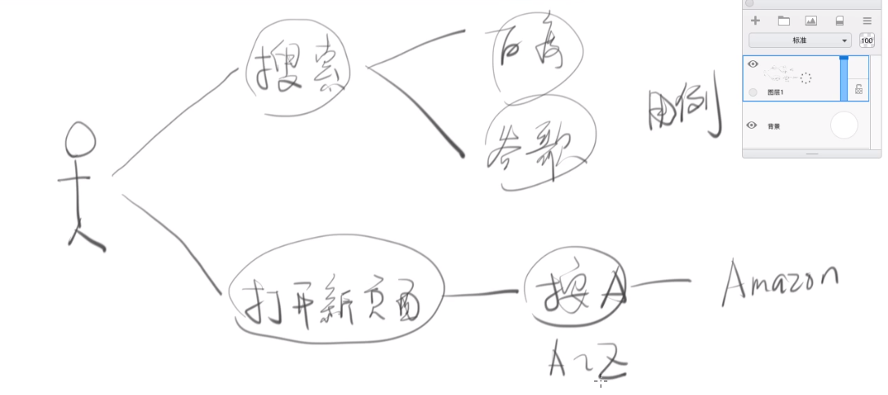
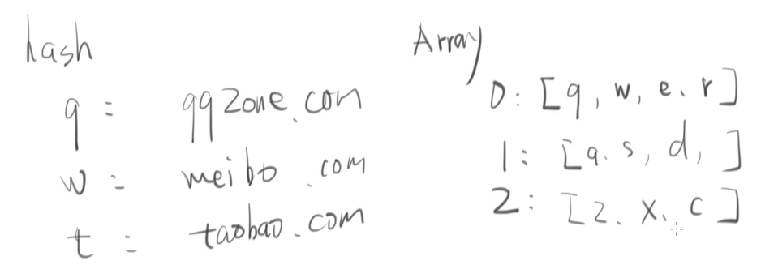

# 做一个导航页面

不学js，直接用js，那我没有学语法怎么办？告诉你个技巧，直接当成伪代码用，你就当你在写伪代码，当你写了一百行的js代码，然后再教你js。简单来说，就是让你做两个小作品，对自己有点成就感，能够继续学习下去。

要怎么做呢？

- 做一个网站之前，要搞清楚这个网站是什么？写一写，画一画
- 使用用例图，画一个人，想想那个人可以有什么操作？用户进入我们网站有哪些功能？
- 选择数据结构，q对应着`qq.com`「哈希」，键盘有三行，怎么把键盘的结构的存储下来「数组」，使用三个数组
- 使用编辑器新建文件夹和文件，当然也可以在`git Bash`里面使用命令新建文件夹和文件
- 怎么把键盘做出来，方法1：一个一个的写，方法2：用js生成键盘`keyboard`（kbd）
- 遍历keys对象，往页面中插入`div、kbd`标签，生成多个div和多个kbd标签
- 
- 创建一个div标签，放到一个容器里面

网站的用例图

网站使用到的数据结构

有什么办法可以快速帮我写，用代码自动生成标签？

首先把数据写出来，首先是关于所有的按键的对象`keys`，方法1：一个一个把单引号和逗号敲上去，方法2：使用正则添加单引号和逗号

## 技巧：

那如何使用正则呢？

VScode使用正则的方法「需要把要处理的字符串单独放到一个文件内，单独处理，因为我也不会很会用VScode使用正则」：

- 点击左边的搜索图标，选中需要匹配的字符串
- 然后点击移动到图标上会出现使用正则表达式
- 搜索：`([a-z])`，替换：`‘$1’,`

`sublime`使用正则的方法：

- 选中要处理的字符串，然后按快捷键<kbd>ctrl<kbd>+<kbd>H<kbd>「win下是这个快捷键，mac不是的话，就要自己找一下replace的按钮，下同」
- 点击鼠标移上去的时候出现`In Selection`「第一行第五个图标」，然后再点击「第一行第一个图标」开启正则匹配或者按快捷键<kbd>Alt<kbd>+<kbd>R<kbd>
- 在`Find:`对应的框写上`([a-z])`，在`Replace:`对应的框写上`'\1',`
- 然后再点击`Replace All`，大功告成。

数组就是hash

第一个错误：

`Uncaught SyntaxError: Unexpected token ]`

没有被处理的语法：不期待的字符串]，其实浏览器就是说，我觉得这里不应该有]这个符号

kbd标签里面什么都没有

思路：

- 先生成一个div标签，往页面里面插进去，然后再生成一个kbd标签，再往div里面插进去
- 生成一个kbd标签，变成生成10个kbd标签，每个div里面弄10个kbd标签

参考一个并不好看的网站：<http://www.36start.com/>

1. 选择数据结构
2. 使用 JS 创建 HTML
3. 添加 CSS
4. 添加事件监听
5. 打开网站

http-server 的使用方法（教程）可以扩展：

1. 安装node
2. npm i -g http-server
3. 进入项目目录
4. 运行 `http-server . -c-1 `（不要自己写，容易错）
5. 用浏览器打开 `http://127.0.0.1:xxxx` （xxxx 是对应的端口号）
6. （可选）打开开发者工具的 Network，勾选 Disable Cache

书写需要注意的点：

「」「」「」「」「」「」「」「」「」「」「」「」「」「」「」「」

 