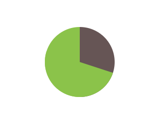

# 利用css画简单的饼图

原理：
基于transform的解决方案，我们现在可以通过一个rotate()变形属性来让这个伪元素转起来。如果我们要显示出20%的比率，我们可以指定旋转的值为72deg（0.2*360 = 72），写成.2turn会更加直观些。

，实现效果的代码，请点击下面的链接

http://js.jirengu.com/kuxicamiqe/1/edit?html,output