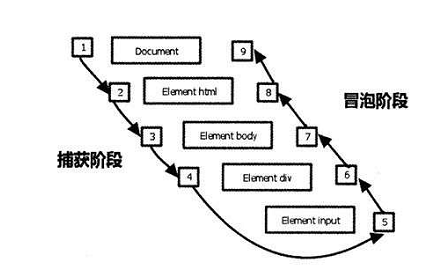

# 选择题

下面关于JavaScript事件的描述中错误的是____

A、`click、mouseenter、blur` 事件是可以冒泡的

B、`mouseenter`、`mouseover`在高级浏览器下是有区别的

C、事件流分为捕获和冒泡两个阶段

D、在Chrome中，可以使用`addEventListener` 来给元素添加事件

选项A：不是所有事件都可以冒泡，其中`blur、focus、load、unload`不能冒泡

选项B：不论鼠标指针穿过被选元素或其子元素，都会触发`mouseover`事件。对应`mouseout`，只有在鼠标指针穿过被选元素时，才会触发`mouseenter`事件。

选项C：事件从根节点开始，逐级派送到子节点，若节点绑定了事件动作，则执行动作，然后继续走，这个阶段称为"捕获阶段（Capture）"；执行完捕获阶段后，事件由子节点往根节点派送，若节点绑定了事件动作，则执行动作，然后继续走，这个阶段称为”冒泡阶段（Bubble）“。如下图所示。

选项D：IE中使用自有的`attachEvent`函数绑定事件，其他浏览器使用`addEventListener` 来给元素绑定事件

