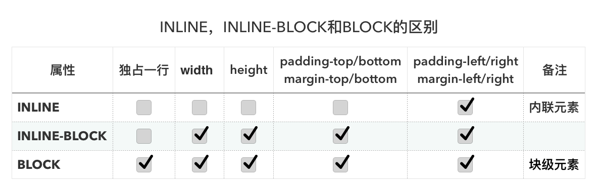

# `inline`，`inline-block`和`block`的区别

下面通过一个表来说明一下，再加上文字说明

## display:`inline`

1. `inline`元素**不会独占一行**，多个相邻的行内元素会排列在同一行里，直到一行排列不下，才会换一行显示，其宽度随元素的内容而变化。
2. `inline`元素**设置`width,height`属性无效**。
3. `inline`元素的`margin`和`padding`属性，**竖直方向**的`padding-top, padding-bottom, margin-top, margin-bottom`**不会产生边距效果**。**水平方向**的`padding-left, padding-right, margin-left, margin-right`**产生边距效果**。

## display:inline-block

1. `inline-block`元素**不会独占一行**，多个相邻的行内元素会排列在同一行里，直到一行排列不下，才会换一行显示，其宽度随元素的内容而变化。
2. `inline-block`元素**可以设置`width,height`属性**。
3. `inline-block`元素的`margin`和`padding`属性，**竖直方向**的`padding-top, padding-bottom, margin-top, margin-bottom`**产生边距效果**。**水平方向**的`padding-left, padding-right, margin-left, margin-right`**产生边距效果**。

## display:block

1. `block`元素**会独占一行**，多个相邻的行内元素会排列在同一行里，直到一行排列不下，才会新换一行，其宽度随元素的内容而变化。
2. `block`元素**可以设置`width,height`属性**。
3. `block`元素的`margin`和`padding`属性，**竖直方向**的`padding-top, padding-bottom, margin-top, margin-bottom`**产生边距效果**。**水平方向**的`padding-left, padding-right, margin-left, margin-right`**产生边距效果**。

block和inline这两个概念是简略的说法，完整确切的说应该是：

1. 【block】 block-level elements (块级元素) ，block元素通常被现实为独立的一块，会单独换一行；
2. 【inline】 inline elements (内联元素)。inline元素则前后不会产生换行，一系列inline元素都在一行内显示，直到该行排满。

大体来说HTML元素各有其自身的布局级别（block元素还是inline元素）：

1. 常见的块级元素有 `DIV, FORM, TABLE, P, PRE, H1~H6, DL, OL, UL` 等。
2. 常见的内联元素有 `SPAN, A, STRONG, EM, LABEL, INPUT, SELECT, TEXTAREA, IMG, BR` 等。

一般来说，可以通过display:inline和display:block的设置，改变元素的布局级别。

1. block元素可以包含block元素和inline元素；
2. 但inline元素只能包含inline元素。

要注意的是这个是个大概的说法，每个特定的元素能包含的元素也是特定的，所以具体到个别元素上，这条规律是不适用的。*比如 P 元素，只能包含inline元素，而不能包含block元素。*

参考链接：[inline，inline-block和block的区别](https://www.jianshu.com/p/f28bb73b383e)